# Windows-Firewall-Security-Lab
Hands-on Windows Firewall security lab demonstrating rule creation, traffic filtering, and defensive security analysis using PowerShell.
# Windows Firewall Security Lab

## Table of Contents

- [Skills Demonstrated](#skills-demonstrated)
- [Lab Environment](#lab-environment)
- [Screenshots](#screenshots)
- [Security Analysis](#security-analysis)
- [MITRE ATTCK Relevance](#mitre-attck-relevance)
- [Key Learnings](#key-learnings)

## Objective

This project demonstrates how Windows Firewall rules can be configured, tested, and analyzed in a controlled lab environment to understand host-based security controls, network filtering, and defensive security operations.

The lab focuses on:

* Creating and managing firewall rules
* Blocking and allowing network traffic
* Testing inbound and outbound connections
* Monitoring firewall behavior
* Understanding how endpoint firewalls reduce attack surface

---

# Skills Demonstrated

* Windows Firewall Configuration
* Network Security
* Defensive Security
* PowerShell Administration
* Port Filtering
* SOC Fundamentals
* Traffic Analysis
* Security Documentation
* Troubleshooting Connectivity Issues

---

# Lab Environment

| Component          | Details                               |
| ------------------ | ------------------------------------- |
| Operating System   | Windows 10                            |
| Tools Used         | Windows Defender Firewall, PowerShell |
| Environment        | Virtual Lab                           |
| Purpose            | Firewall Rule Analysis & Testing      |
| Connectivity Tests | Ping, TCP Connections                 |
| Security Focus     | Host-Based Firewall Protection        |

---

# Project Structure

```text
Windows-Firewall-Security-Lab/
│
├── README.md
├── screenshots/
│   ├── firewall-rule-type-selection.jpg
│   ├── firewall-rule-final-configuration.jpg
│   ├── windows-firewall-inbound-rules.jpg
│   ├── windows-firewall-outbound-rules.jpg
│   ├── ssh-port-rule-selection.png
│   ├── ssh-port-configuration.png
│   ├── ssh-firewall-action-block.png
│   ├── ssh-firewall-rule-created.png
│   ├── telnet-port-block-test.jpg
│   ├── telnet-port-selection.jpg
│   ├── telnet-firewall-block-action.jpg
│   ├── telnet-firewall-rule-list.jpg
│   └── telnet-connection-failed.png
```

---

# Lab Architecture

```text
[Client/Test Machine]
        |
   Network Traffic
        |
[Windows Target System]
        |
 Windows Firewall
        |
 Allowed / Blocked Connections
```

---

# Firewall Rule Creation

## Creating a Rule to Block Port 80

```powershell
New-NetFirewallRule -DisplayName "Block Port 80" `
-Direction Inbound `
-Protocol TCP `
-LocalPort 80 `
-Action Block
```

### Purpose

This rule blocks inbound HTTP traffic on TCP port 80 to prevent unauthorized web-based access.

---

# Screenshots

## Firewall Rule Type Selection

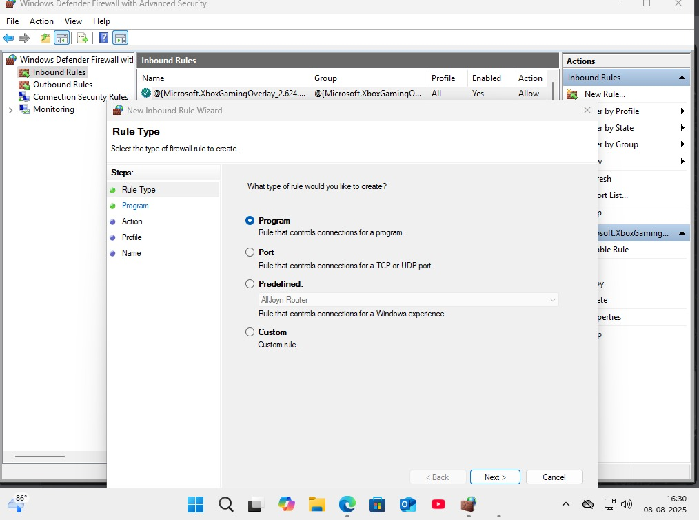

---

## Firewall Rule Final Configuration

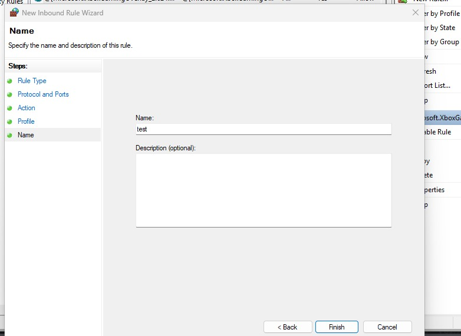

---

## Windows Firewall Inbound Rules

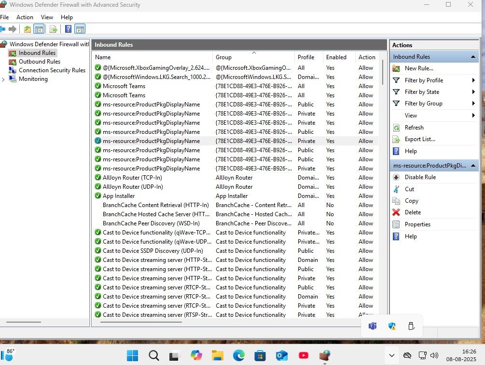

---

## Windows Firewall Outbound Rules

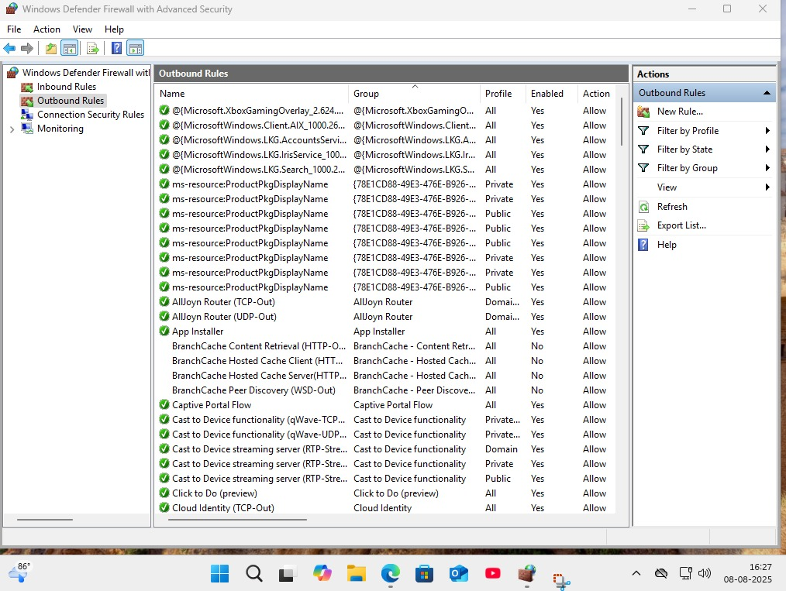

---

## SSH Port Rule Selection

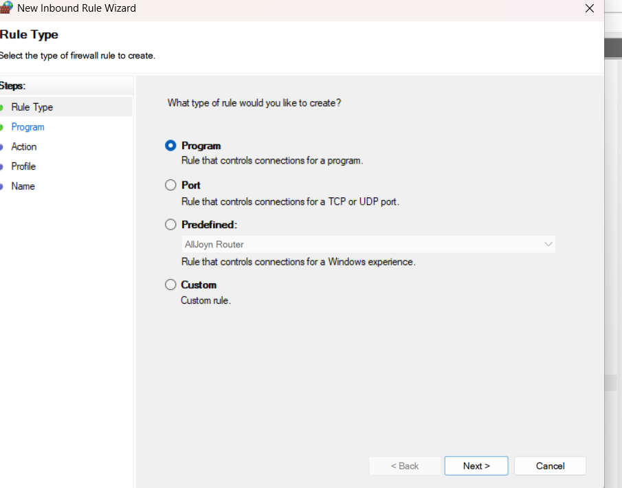

---

## SSH Port Configuration

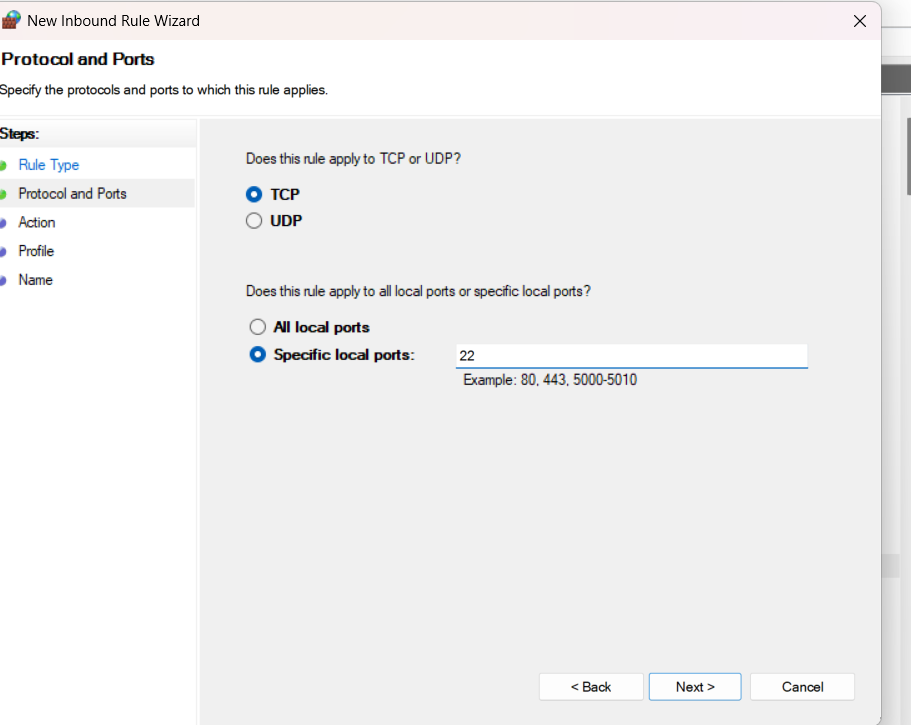

---

## SSH Firewall Action Block

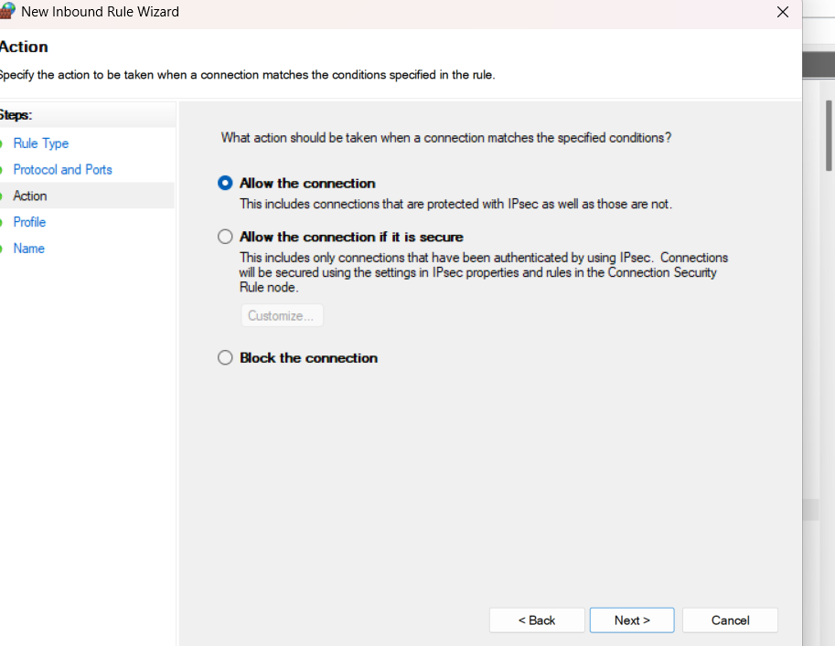

---

## SSH Firewall Rule Created

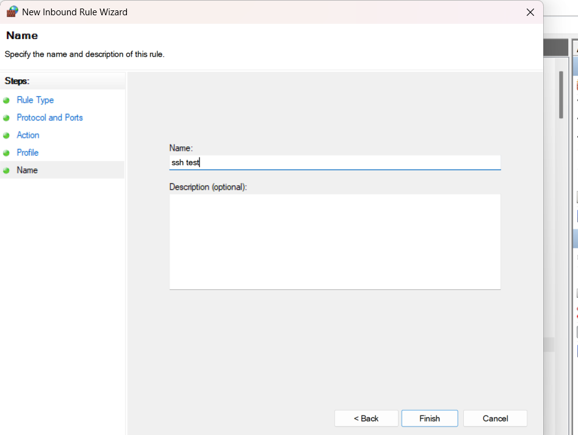

---

## Telnet Port Block Test

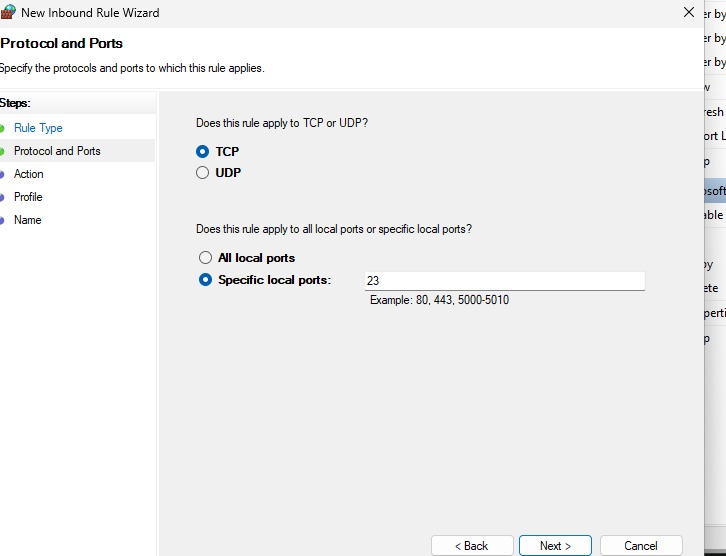

---

## Telnet Port Selection

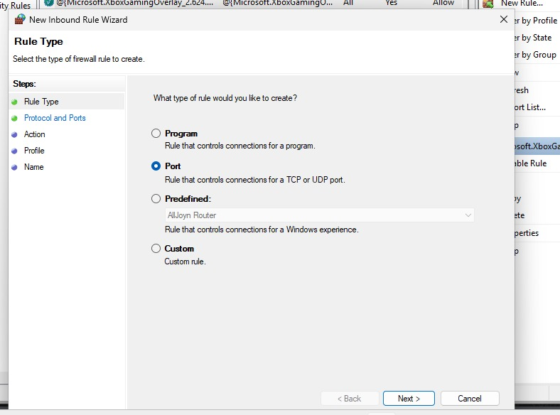

---

## Telnet Firewall Block Action

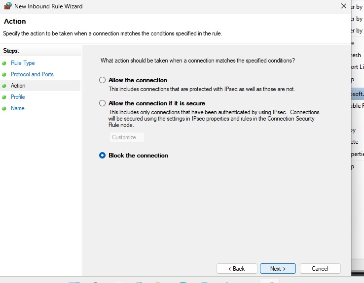

---

## Telnet Firewall Rule List

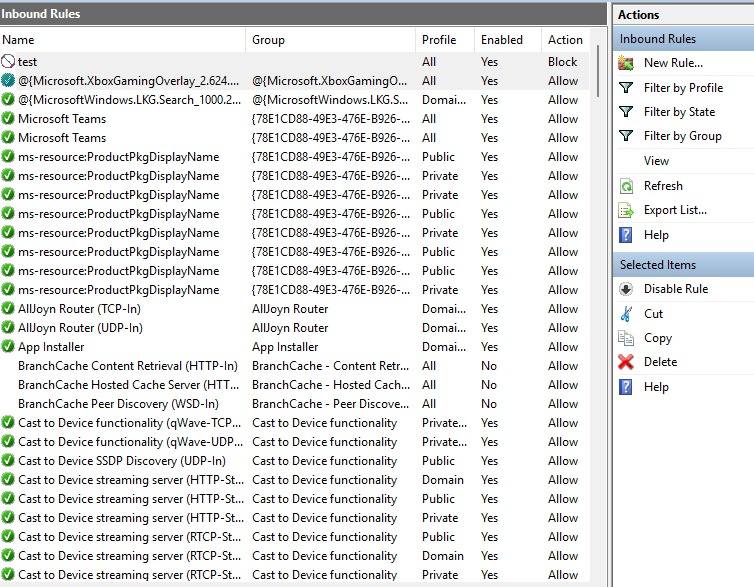

---

## Telnet Connection Failed

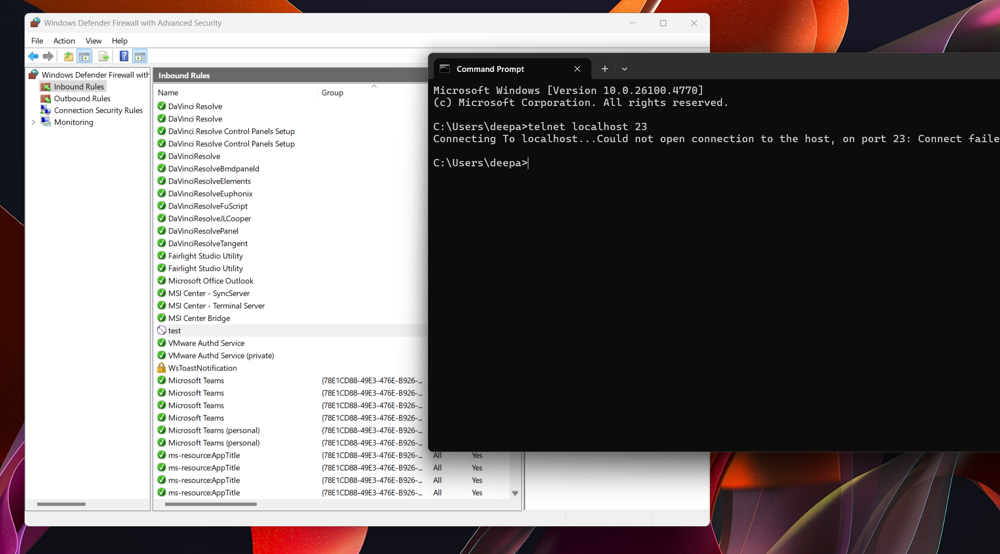

---

# Display Existing Firewall Rules

```powershell
Get-NetFirewallRule
```

### Purpose

Used to enumerate and verify active firewall rules configured on the system.

---

# Check Specific Firewall Rule

```powershell
Get-NetFirewallRule -DisplayName "Block Port 80"
```

### Purpose

Verifies whether the custom firewall rule exists and confirms its status.

---

# Test Connectivity

## Test Localhost Connection

```powershell
Test-NetConnection localhost -Port 80
```

### Expected Behavior

The firewall should block inbound traffic depending on rule configuration.

---

# Attempted Connection Result

```text
ComputerName     : localhost
RemoteAddress    : 127.0.0.1
RemotePort       : 80
TcpTestSucceeded : False
```

### Analysis

The failed connection confirms that the firewall rule successfully blocked access to TCP port 80.

---

# Allowing Traffic Again

## Remove Blocking Rule

```powershell
Remove-NetFirewallRule -DisplayName "Block Port 80"
```

### Purpose

Removes the previously created blocking rule and restores connectivity.

---

# Verify Firewall Rule Removal

```powershell
Get-NetFirewallRule -DisplayName "Block Port 80"
```

### Expected Result

The rule should no longer appear in firewall rule listings.

---

# Successful Connection Test

```text
TcpTestSucceeded : True
```

### Analysis

The successful connection confirms that firewall filtering behavior changed after removing the blocking rule.

---

# Security Analysis

Windows Firewall is a critical endpoint security control used to:

* Restrict unauthorized network access
* Reduce attack surface exposure
* Control inbound and outbound communication
* Prevent lateral movement
* Enforce organizational security policies

In this lab:

* Firewall rule creation was tested
* Port filtering behavior was validated
* Network access control was analyzed
* Traffic blocking effectiveness was confirmed
* Basic defensive security operations were simulated

This type of analysis is directly relevant to SOC and Blue Team environments.

---

# MITRE ATT&CK Relevance

| Technique ID | Technique                 |
| ------------ | ------------------------- |
| T1562        | Impair Defenses           |
| T1046        | Network Service Discovery |
| T1021        | Remote Services           |

Understanding firewall behavior helps defenders:

* Detect unauthorized access attempts
* Prevent remote exploitation
* Restrict attacker movement across systems
* Harden endpoint security configurations

---

# Challenges Faced

* Understanding inbound vs outbound rules
* Testing localhost connectivity behavior
* Verifying firewall rule precedence
* Troubleshooting blocked connections

---

# Key Learnings

* Windows Firewall can effectively filter network traffic
* PowerShell allows automated firewall management
* Improper firewall configurations may expose systems
* Rule testing is important for defensive security validation
* Endpoint firewalls play a major role in enterprise security

---

# Future Improvements

* Integrate firewall logs with Splunk SIEM
* Automate monitoring using PowerShell scripts
* Export logs for threat analysis
* Detect suspicious firewall rule modifications
* Create advanced rule sets for enterprise scenarios
* Simulate attacker behavior against firewall policies

---

# Tools Used

* Windows Defender Firewall
* PowerShell
* Test-NetConnection
* Windows Networking Utilities

---

# Author

Deepak Rawat
Cybersecurity Enthusiast | SOC Analyst Aspirant | Blue Team Learning Path

GitHub: https://github.com/Deepak2652005

---

# Disclaimer

This project was created in a controlled lab environment for educational and defensive security purposes only.
